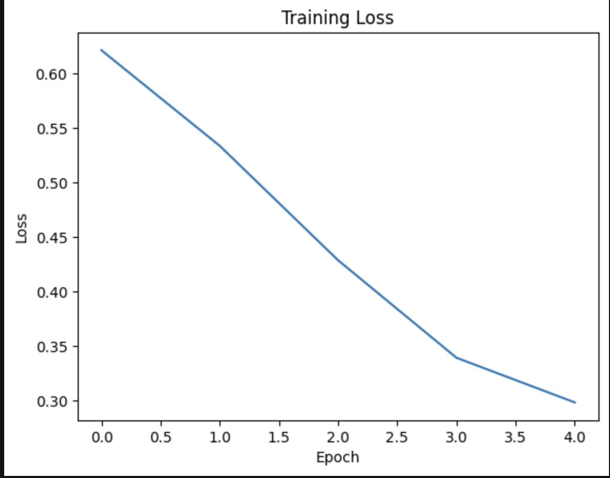
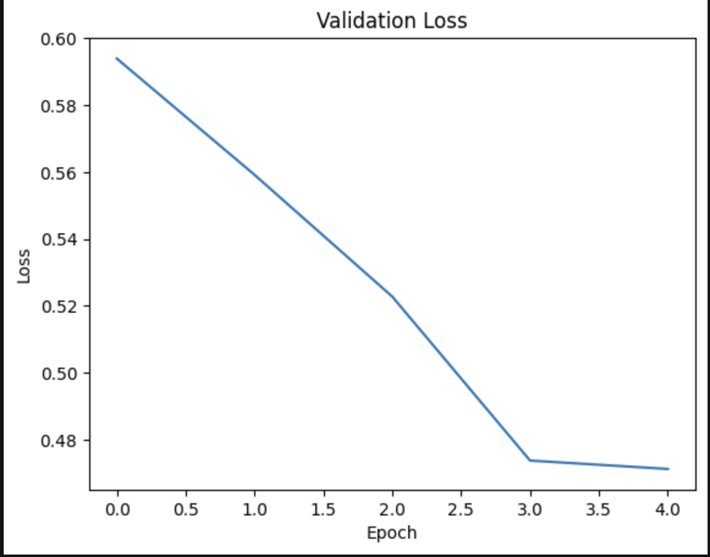
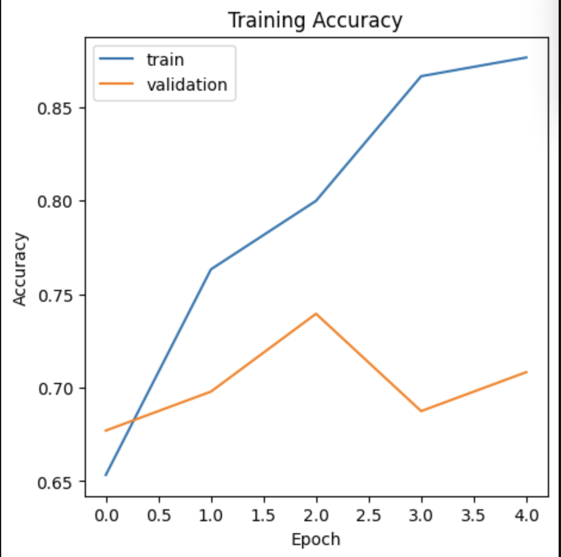
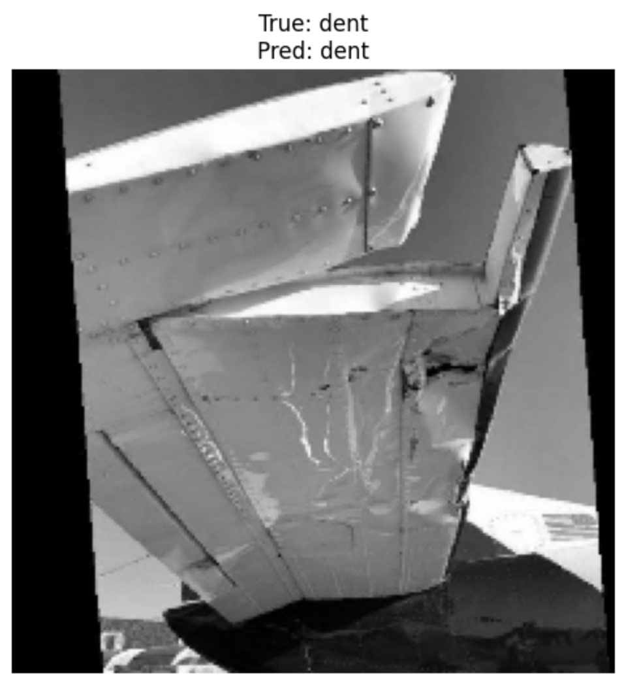

# ✈️ Aircraft Damage Classification and Image Captioning

A deep learning project that combines computer vision and natural language processing to analyze aircraft damage images. The project uses transfer learning with VGG16 to classify aircraft damage and a BLIP transformer model to generate image captions and summaries.

---

## 📖 Project Overview

Aircraft inspections are critical for maintaining aviation safety. Manual inspection processes can be time-consuming, costly, and susceptible to human error. This project explores how artificial intelligence can assist aircraft maintenance by automatically classifying damage and generating natural language descriptions of aircraft images.

The project combines two AI tasks:

### Aircraft Damage Classification

A VGG16-based transfer learning model is trained to classify aircraft damage into:

* Dent
* Crack

### Image Captioning and Summarization

A BLIP (Bootstrapping Language-Image Pretraining) transformer model generates:

* Image captions
* Detailed image summaries

Together, these components create an intelligent vision-language pipeline capable of both recognizing and describing aircraft damage.

---

## 🎯 Objectives

* Build a deep learning model for aircraft damage classification.
* Apply transfer learning using a pretrained VGG16 network.
* Evaluate classification performance using accuracy and loss metrics.
* Generate image captions using BLIP.
* Generate descriptive summaries from aircraft images.
* Demonstrate the integration of computer vision and transformer-based NLP models.

---

## 🧠 Aircraft Damage Classification

### Model Architecture

The classification system uses:

* VGG16 (ImageNet Pretrained)
* Transfer Learning
* Feature Extraction
* Dense Classification Layers
* Binary Classification Output

### Workflow

1. Download and preprocess aircraft images.
2. Normalize image data using ImageDataGenerator.
3. Extract image features using VGG16.
4. Train a custom classifier head.
5. Evaluate model performance on unseen test images.

---

## 📊 Classification Results

### Training Loss



### Validation Loss



### Accuracy Curve



### Prediction Example



---

## 🤖 Image Captioning and Summarization

### Model

The captioning system uses:

* BLIP (Bootstrapping Language-Image Pretraining)
* Hugging Face Transformers
* Image-to-Text Generation

### Workflow

1. Load aircraft image.
2. Process image using the BLIP processor.
3. Generate image caption.
4. Generate detailed summary.

---

## 📝 Caption Generation Results

### Generated Caption


### Generated Summary


---

## 🛠️ Technologies Used

| Technology   | Purpose                 |
| ------------ | ----------------------- |
| Python       | Programming Language    |
| TensorFlow   | Deep Learning Framework |
| Keras        | Model Development       |
| VGG16        | Transfer Learning       |
| Transformers | NLP Framework           |
| BLIP         | Image Captioning        |
| NumPy        | Numerical Computing     |
| Matplotlib   | Data Visualization      |
| Pillow       | Image Processing        |

---

## 📁 Repository Structure

```text
aircraft-damage-classification-captioning/
│
├── README.md
├── requirements.txt
├── main.py
│
├── src/
│   ├── data_loader.py
│   ├── classifier.py
│   ├── visualization.py
│   └── captioning.py
│
├── images/
│   ├── training_loss.png
│   ├── validation_loss.png
│   ├── accuracy_curve.png
│   ├── prediction_example.png
│   ├── generated_caption.png
│   └── generated_summary.png
│
└── models/
```

---

## 🚀 Future Improvements

* Experiment with ResNet50 and EfficientNet architectures.
* Expand the dataset with additional aircraft damage categories.
* Deploy the model as a web application.
* Integrate object detection for localized damage analysis.
* Fine-tune larger vision-language models for richer image descriptions.
* Explore multimodal large language models for enhanced reporting capabilities.

---

## 💡 Key Learnings

Through this project, I gained practical experience with:

* Transfer Learning
* Computer Vision
* Deep Learning Model Training
* Image Classification
* Hugging Face Transformers
* Vision-Language Models
* Image Caption Generation
* Model Evaluation and Visualization

---

## 👨‍💻 Author

**Samridhi Bhardwaj**

Originally developed as part of an AI and Deep Learning project and later refactored into a structured portfolio project.
